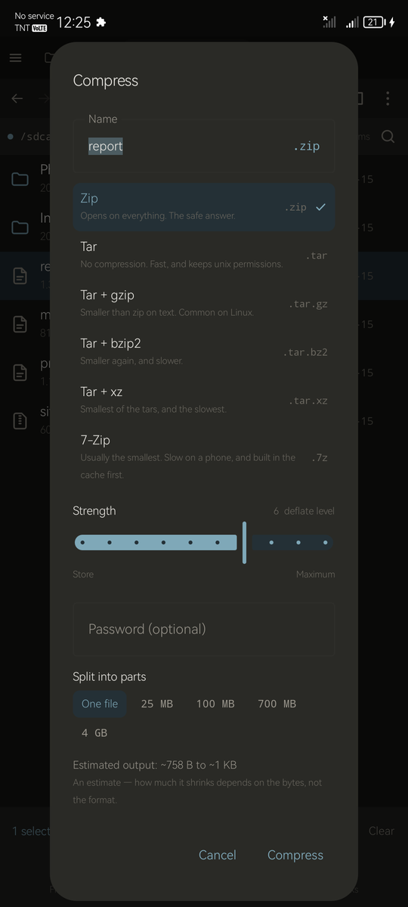
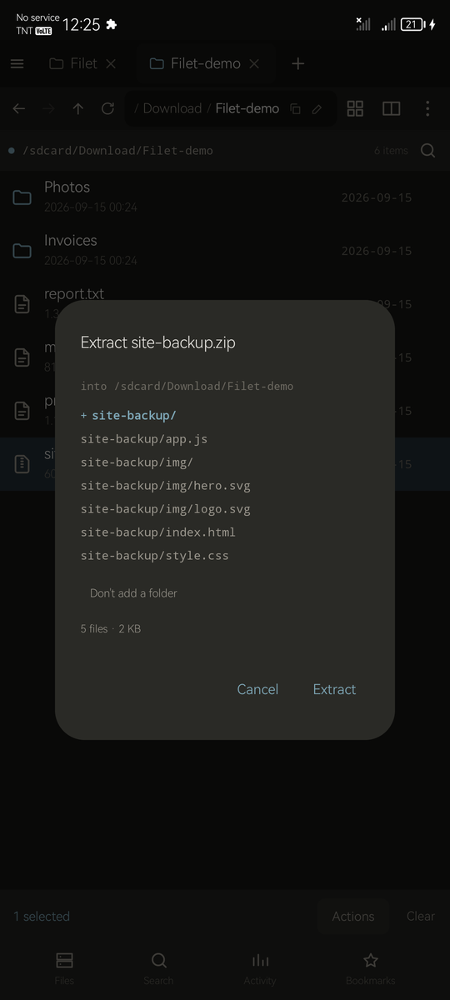
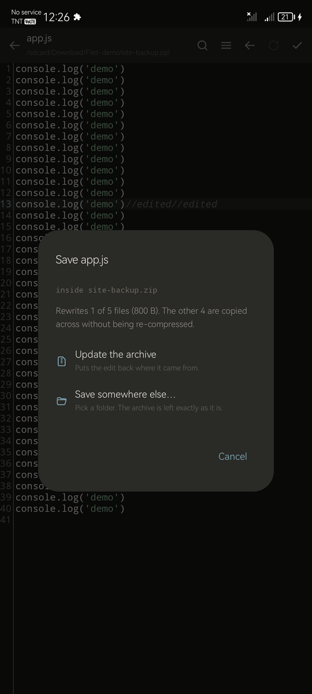

<div align="center">


# Filet

**A file manager for doing real work on your phone, without reaching for a PC.**

[](LICENSE)
[](#building-it-yourself)
[](#building-it-yourself)
[](https://github.com/uukjtisa/filet/releases/latest)
[](FIXES.md)

Companion to **[Trawl](https://github.com/uukjtisa/trawl)**.
Built by **[Niccc2007](https://github.com/uukjtisa)**.

</div>

> [!WARNING]
> **Early development.** I built this for my own phone and I'm still finding things wrong with
> it. There's no store listing - [Releases](https://github.com/uukjtisa/filet/releases) is the
> only place it comes from. Everything below is what the code does today, not what I want it
> to do later.

---

## Table of Contents

- [What Filet is](#what-filet-is)
- [A glimpse of it](#a-glimpse-of-it)
- [Browsing](#browsing)
- [Search](#search)
- [Archives and APKs](#archives-and-apks)
- [Scripting](#scripting)
- [Sharing over your network](#sharing-over-your-network)
- [Shortcuts and surfaces](#shortcuts-and-surfaces)
- [Installing it](#installing-it)
- [How it's built](#how-its-built)
- [Building it yourself](#building-it-yourself)
- [Permissions](#permissions)
- [Licence](#licence)

---

## What Filet is

A file manager built for people who actually use one. Four things it refuses to trade against
each other:

- **Productivity.** Find the file, move it, be done. Search answers in milliseconds across the
  whole device, split panes mean copying is a drag rather than a round trip, and the things you
  do every day are one tap from where you already are.
- **Power.** Edit a file inside an archive without unpacking it. Read the smali inside an APK,
  change it, rebuild and re-sign it on the phone. Script the whole thing in Lua. None of it is
  behind a paywall and none of it is a separate app.
- **Aesthetics.** It is not a spreadsheet of filenames. It has a considered palette, real
  motion, and a layout that holds together on a phone, a tablet and in landscape — because a
  tool you open twenty times a day should not be ugly.
- **Convenience.** Share to any browser on your network with nothing installed on the other
  end. Answer another app's "choose a file". Pick up where you left off. The work is in making
  the common path short.

Free, open source, no ads, no accounts, no telemetry, and no feature held back for a paid tier.
There isn't one.

---

## A glimpse of it

<p align="center">
  
  
  
</p>
<p align="center">
  
  
  
</p>
<p align="center">
  
  
  
</p>

<p align="center"><sub>
Browsing &middot; split panes &middot; search<br>
Compressing &middot; previewing an extraction before it happens &middot; editing a file inside an archive<br>
APK inspector &middot; Lua scripts &middot; sharing
</sub></p>

<p align="center">
  
</p>

<p align="center"><sub>
And what a laptop on the same network sees. No app, no account, no cable.
</sub></p>

<p align="center"><sub>
Screenshots use a seeded demo folder, not real files.
</sub></p>

---

## Browsing

- **Two panes**, labelled A and B, each with its own history and selection
- **Drag between them.** Same volume moves, a different volume copies, and the ghost under
  your finger says which before you let go
- **Six view densities** on one slider, from a compact list to a large grid
- **Thumbnails** for images, video frames, album art and APK icons, cached on content so a
  rename doesn't re-decode anything
- **Back, forward, up and refresh** in the toolbar, greyed when there's nowhere to go
- **Type a path** and press Go, bare paths like `/sdcard/Download` included
- **Per-extension default openers**, and when you hand a file to another app it remembers
  which app

---

## Search

Search runs in two stages. SQL narrows two hundred thousand rows down to five hundred, then a
scorer reranks those in memory. Neither half is asked to do the other's job.

- **Fuzzy matching** with word-boundary and camelCase bonuses. `dwnld` finds Downloads, `AM`
  finds AndroidManifest.xml
- **Typo tolerance**, Damerau-Levenshtein, applied only to the five hundred candidates and
  never as retrieval
- **Frecency**, so what you open often and recently floats up
- **A query language**: `type: size: modified: in: from: pkg: class: perm: inzip: dup:` with
  AND, OR, NOT and grouping. Bad syntax degrades to a substring search instead of erroring
- **Four scopes** as chips: this folder, subfolders, whole device, provenance
- **Verified before display.** Every hit is re-checked against the filesystem, so the index
  can be stale without you ever seeing a stale result

---

## Archives and APKs

- **Browse into an archive as a folder**, addressed as `zip:///path/a.tar.gz!/inner`. Zip and
  everything zip-shaped (apk, jar, aar, epub, cbz), tar on its own or through gzip, bzip2 or
  xz, 7z, RAR and RAR5 including solid archives, and a single compressed file such as
  `notes.txt.gz`
- **Make one** in zip, tar, tar.gz, tar.bz2, tar.xz or 7z, with the format picked at the time
  and the suffix taken from the format rather than from what you typed
- **Options tailored to the format, and nothing that does not apply.** Compression strength in
  the encoder's own units — deflate 0-9, LZMA2's preset, bzip2's *block size*, which is not an
  effort setting at all — a password where the format has encryption, and a split size where
  the format can be split. Each control is drawn from one capability table, so a format cannot
  show a switch its writer will refuse later
- **Zip encryption that is real**: AES-256, AES-128, or the old ZipCrypto, offered and labelled
  weak rather than hidden, because some readers take nothing else. Verified by opening Filet's
  own archives in 7-Zip, including checking that the wrong password is refused
- **Split archives**, both ways: zip volumes or a numbered `.001` byte split when you make one,
  and a `.part1.rar` / `.r00` / `.zip.001` set someone sent you reads as a single archive
- **An estimate of what it will weigh**, as a range with a reason. Already-compressed media is
  counted separately, so a folder of mp4s is never promised a saving it will not get
- **Extract here, to a folder you pick, or straight into the other pane** — and every one of
  them shows you the result first
- **A preview of the extraction, before it happens.** It draws the destination as it will be:
  the folder it is about to invent is marked, a redundant parent it lifted away is struck
  through, and it tells you what would be overwritten, whether it fits, how many files and how
  many bytes, and how many entries tried to write outside the folder. Two buttons reverse the
  two decisions, one tap each. The preview and the extractor are the same value — not a drawing
  of what a separate code path might do
- **It wraps and unwraps on its own, and it is right about it.** An archive with loose files at
  the top lands in a folder named after it, so nothing is dumped over your Downloads; an archive
  that is nothing but one folder holding one folder is unwrapped, all the way down while each
  level holds exactly one thing
- **Edit a file inside an archive.** Saving offers to update the archive or to write the file
  somewhere else. A zip or a plain tar re-compresses only the file you changed — the others are
  copied across as raw compressed bytes — while a `tar.gz` or a 7z is one compression stream and
  has to be rebuilt whole, which it tells you, with the count and the size, before it starts. An
  encrypted archive is refused rather than rewritten, because rewriting one entry would leave
  the rest protected and that one not
- **Search inside them.** `inzip:` reads member names from every format above
- **RAR reads, and Filet cannot create one — that distinction is a licence, not a gap.**
  Every RAR decoder published for the JVM descends from RARLAB's UnRAR source, whose licence
  forbids using it to build a RAR-compatible archiver. That is a field-of-use restriction and
  GPL-3 §7 does not allow one to be added, so none of them can ship here. **libarchive's RAR
  readers are different**: `archive_read_support_format_rar.c` and `…rar5.c` are independent
  implementations under BSD-2-Clause, which GPL-3 can take. They are vendored in
  [`core-native/`](core-native/README.md) — about 130 KB per ABI, the only native code in the
  app. Writing a RAR is the part RARLAB's licence actually protects, so Filet does not
- **A 7z cannot be given a password, and that is also a licence answer rather than laziness.**
  The format supports AES-256 perfectly well; nothing Filet can legally ship *writes* it.
  libarchive's 7z writer contains no encryption at all — zero occurrences of `passphrase`,
  `aes`, `encrypt` or `crypt` in its 2,356 lines, against eleven and an `aes256` option in the
  zip writer of the same release — and commons-compress writes 7z without it. The one encoder
  that does is 7-Zip's own C++ tree, which GPL-3 *can* take; it is a vendoring project rather
  than a feature. The whole measurement is in [`core-native/`](core-native/README.md), and the
  dialog says this instead of showing a grey box. Use zip if the archive needs a password
- **`classes.dex` opens as a tree of smali** you can read and edit
- **Search inside APKs.** `pkg:`, `label:` and `perm:` come from the resource table, `class:`
  from deduplicated package prefixes in the dex. About 2 KB of facts per APK, not 2 MB
- **Inspect** signature schemes, signer, SDK levels, native ABIs and protection status
- **Edit the binary manifest** without needing aapt2
- **Rebuild and re-sign**, reading minSdk from the APK being rebuilt so the dex format it
  emits is one the target device can actually load

---

## Scripting

Lua, bound to the storage layer rather than to the filesystem, so a script that works on
internal storage also works inside an archive or on a network share.

- **A permission header** each script declares up front, and you approve it before it runs
- **No `io`, no `os.execute`, no network.** The `fs` table is the whole surface
- **Seven worked examples** ship with the app
- **A copyable prompt** that explains the entire API to an AI agent, so you can paste it and
  append what you want in plain words

---

## Sharing over your network

- **Any browser can open it.** Nothing installed on the other machine
- **Every address the phone can be reached on**, labelled Wi-Fi, hotspot or wired, with the
  unreachable ones marked and the reason given
- **Paths never enter a URL.** A URL is `/f/<token>`, which makes traversal unrepresentable
  rather than blocked
- **A PIN by default**, settable and copyable, with a QR code
- **Every session listed live and revocable**, and nothing expires unless you ask it to
- **Folders open in the browser**, or download whole as a streamed zip with the tree intact
- **Zero-copy streaming.** Sharing a 4 GB video costs no extra space and starts instantly

---

## Shortcuts and surfaces

- **Home-screen shortcuts that survive a move.** A shortcut stores the file's index ID rather
  than its path, so moving the file doesn't break it, and deleting it makes the shortcut say
  so instead of doing nothing
- **Shortcuts to scripts and to app actions**, not only to files
- **All of them listed inside the app**, renameable and cleanable, because a pinned shortcut
  is otherwise write-only
- **A folder widget**
- **Crash reports on screen** instead of "app has stopped", kept locally and never uploaded

---

## Installing it

Grab the APK from **[Releases](https://github.com/uukjtisa/filet/releases/latest)**. Android 8.0
or newer, one file, every phone. The only native code in Filet is libarchive's RAR readers, at
about 130 KB per ABI, so a universal APK carries all four and there is nothing worth splitting.

| File | For |
|---|---|
| `Filet-<version>.apk` | Anything running Android 8.0 or newer. |

You will have to allow installing from unknown sources, and Android will call the installer
untrusted: the APK is signed with my own key rather than a store key, which is what a sideloaded
build looks like. That key is also why an update has to come from the same place the first
install did - Android refuses an update signed by anything else.

Once it is installed, the **About** page - from the side rail, the menu, or the switcher - has a
**Check for updates** button that asks GitHub directly and offers the next release when there is
one. That button is compiled out of the `fdroid` flavour, because F-Droid updates its own apps
and refuses ones that update themselves.

---

## How it's built

Six layers, and only the bottom one is allowed to touch a filesystem.

| Layer | What lives there |
|---|---|
| **L5** Surfaces | Compose UI, panes, tabs, split view |
| **L4** Runtime | Lua scripts, background jobs, the activity ledger |
| **L3** Handlers | Viewers, editors, the APK toolchain |
| **L2** Routing | What opens what, inbound and internal |
| **L1** Index | SQLite FTS5 and trigram, retrieve then rerank |
| **L0** VFS | `FileSystemProvider` per backend, `VPath`, `VNode` |

### The VFS is the whole design

Nothing above L0 constructs a platform path. There's no `java.io.File` outside the local
provider, and `tools/check-r3.mjs` fails the build if one turns up. The allow-list is fourteen
files long and every entry carries a written reason for being there.

That one constraint is what makes archives, network shares, SAF grants and root all work
through a single code path instead of five special cases. It's also why a new backend is a new
file rather than a new set of exceptions scattered through the app.

### Everything is checked rather than claimed

- **[`FEATURES.md`](FEATURES.md)** is the feature register, 69 shipped, with per-feature notes
- **[`GATES.md`](GATES.md)** is the per-milestone evidence, including the one gate that was
  abandoned and why
- **[`FIXES.md`](FIXES.md)** tracks every bug found in review to a demonstrated outcome
- **[`PLAN.md`](PLAN.md)**, **[`SEARCH.md`](SEARCH.md)** and **[`NEARBY.md`](NEARBY.md)** are
  the design documents
- **[`docs/RELEASES.md`](docs/RELEASES.md)** is how a release body has to be written, because
  the app renders it and for most people it is the only documentation they will ever read

66 instrumented tests run on a real device, three JVM suites run on the JVM, and CI runs
everything that doesn't need a phone. 57 review items, all of them closed with evidence.

---

## Building it yourself

You'll need the Android SDK and a JDK 21. Android Studio's bundled JBR is the one that's known
to work, and `gw.sh` points `JAVA_HOME` at it.

```bash
git clone https://github.com/uukjtisa/filet
cd filet
./gw.sh :app:assembleGithubDebug
adb install -r -g app/build/outputs/apk/github/debug/app-github-debug.apk
```

Two flavours:

- **`github`** has the in-app updater
- **`fdroid`** compiles it out, because F-Droid forbids an app that updates itself

Debug builds get a `.debug` application ID so they sit beside a release one. `minSdk 26`,
`targetSdk 37`, Kotlin 2.2, Compose Material3.

### Running the checks

```bash
./gw.sh :core-vfs:test :core-index:test :app:testGithubDebugUnitTest   # JVM suites
node tools/check-r3.mjs                                                # no storage API above L0
./tools/run-gates.sh <adb-serial>                                      # 66 on-device tests
```

`run-gates.sh` exists because `connectedAndroidTest` reinstalls the app between runs, which
resets the all-files appop and deletes the artifacts the tests just wrote. Both look like
feature failures and are neither. It installs once, grants, runs the instrumentation directly,
and collects what the tests produced.

`tools/testservers/webdav.py` is a small WebDAV server for exercising the network provider from
a device over `adb reverse`.

---

## Permissions

| Permission | Why |
|---|---|
| All-files access | To browse the shared volume. Filet works without it, but then only folders you pick by hand are visible |
| Foreground service (data sync) | Two uses, both started by you and both visible with a Stop: a full index, and an active share |
| Internet and local network | Sharing and network storage. No analytics, no crash reporting, nothing outbound you didn't ask for |
| Install packages | Only when you tap Install on an APK, or install an update. The system installer still asks |

Crash reports go to app-private storage and are mirrored to `/.filet_logs/` so you can read
them on the phone. They're never uploaded anywhere, because a file manager's stack traces carry
your paths.

---

## Licence

GPL-3.0. See [`LICENSE`](LICENSE).

Filet bundles ARSCLib (Apache-2.0), smali and dexlib2 (BSD), LuaJ (MIT), Apache
commons-compress (Apache-2.0), XZ for Java (public domain) and zip4j (Apache-2.0) for
the archive formats,
sora-editor (LGPL-2.1, linked unmodified), and a build of SQLite with FTS5 and trigram
enabled. Full attribution is on the About screen in the app.

Every one of those is compatible with GPL-3.0, and `tools/check-licences.mjs` fails the build
if a dependency is added that is not. That check is also where the RAR decision is recorded:
the available Java decoders carry the UnRAR licence, which restricts what the software may be
used to build, and a GPL-3 project cannot accept that restriction.
