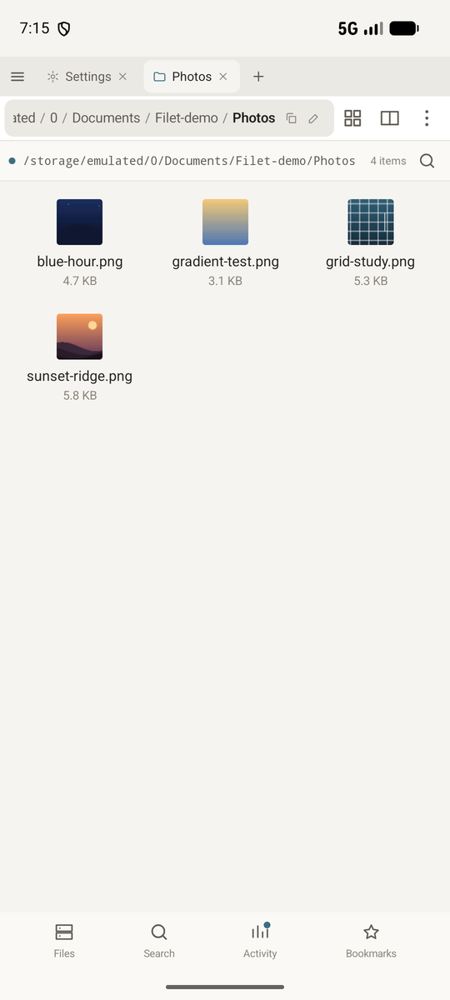
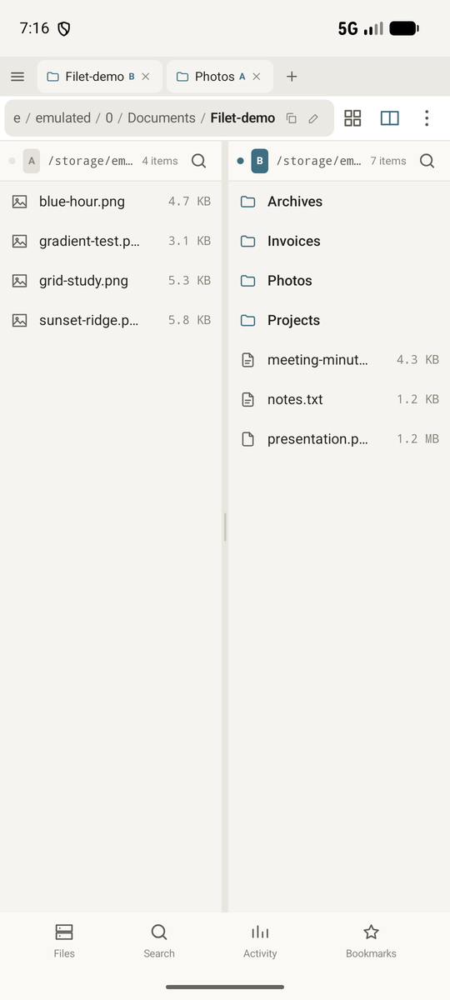
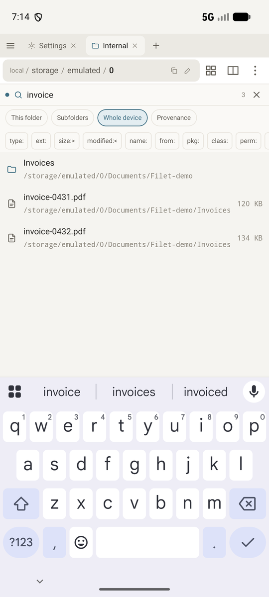
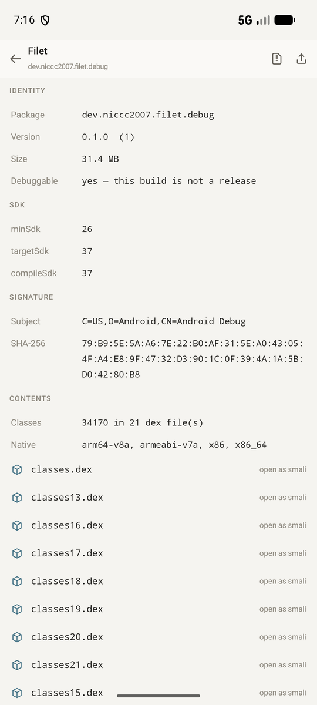
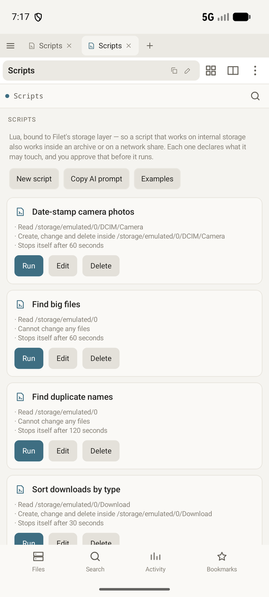
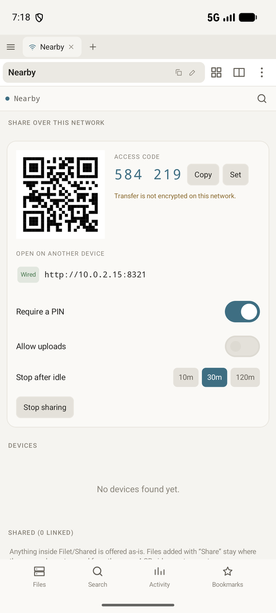
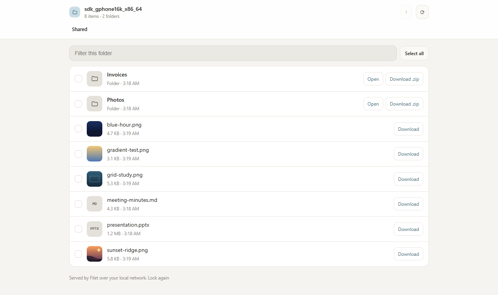

<div align="center">


# Filet

**A file manager for doing real work on your phone, without reaching for a PC.**

[](LICENSE)
[](#building-it-yourself)
[](#building-it-yourself)
[](FIXES.md)

Companion to **[Trawl](https://github.com/uukjtisa/trawl)**.
Built by **[Niccc2007](https://github.com/uukjtisa)**.

</div>

> [!WARNING]
> **Early development.** I built this for my own phone and I'm still finding things wrong with
> it. There's no store listing and no release yet. Everything below is what the code does
> today, not what I want it to do later.

---

## Table of Contents

- [What Filet is](#what-filet-is)
- [A glimpse of it](#a-glimpse-of-it)
- [Browsing](#browsing)
- [Search](#search)
- [Containers and APKs](#containers-and-apks)
- [Scripting](#scripting)
- [Sharing over your network](#sharing-over-your-network)
- [Shortcuts and surfaces](#shortcuts-and-surfaces)
- [How it's built](#how-its-built)
- [Building it yourself](#building-it-yourself)
- [Permissions](#permissions)
- [Licence](#licence)

---

## What Filet is

Most Android file managers treat storage as one place: the internal volume, listed. Reach an
archive and you get an extract button. Reach a network share and you get a different app.

Filet has one storage interface underneath everything, and every backend is a plugin behind
it. A zip is a folder. An APK is a folder, and `classes.dex` inside it is a browsable tree of
smali. A WebDAV share is a folder. So a feature written once works in all of them, and that's
why the Lua scripting can run over a file on a network share it has never seen before.

The rest of the app is what falls out of that:

- Whole-device search that answers in milliseconds, including **inside** APKs
- An APK toolchain that decompiles, edits, rebuilds and re-signs on the phone
- Sharing to any browser on your network, with nothing installed on the other end

---

## A glimpse of it

<p align="center">
  
  
  
</p>
<p align="center">
  
  
  
</p>

<p align="center"><sub>
Browsing &middot; split panes &middot; search &middot; APK inspector &middot; Lua scripts &middot; sharing
</sub></p>

<p align="center">
  
</p>

<p align="center"><sub>
And what a laptop on the same network sees. No app, no account, no cable.
</sub></p>

<p align="center"><sub>
Screenshots use a seeded demo folder, not real files.
</sub></p>

---

## Browsing

- **Two panes**, labelled A and B, each with its own history and selection
- **Drag between them.** Same volume moves, a different volume copies, and the ghost under
  your finger says which before you let go
- **Six view densities** on one slider, from a compact list to a large grid
- **Thumbnails** for images, video frames, album art and APK icons, cached on content so a
  rename doesn't re-decode anything
- **Back, forward, up and refresh** in the toolbar, greyed when there's nowhere to go
- **Type a path** and press Go, bare paths like `/sdcard/Download` included
- **Per-extension default openers**, and when you hand a file to another app it remembers
  which app

---

## Search

Search runs in two stages. SQL narrows two hundred thousand rows down to five hundred, then a
scorer reranks those in memory. Neither half is asked to do the other's job.

- **Fuzzy matching** with word-boundary and camelCase bonuses. `dwnld` finds Downloads, `AM`
  finds AndroidManifest.xml
- **Typo tolerance**, Damerau-Levenshtein, applied only to the five hundred candidates and
  never as retrieval
- **Frecency**, so what you open often and recently floats up
- **A query language**: `type: size: modified: in: from: pkg: class: perm: inzip: dup:` with
  AND, OR, NOT and grouping. Bad syntax degrades to a substring search instead of erroring
- **Four scopes** as chips: this folder, subfolders, whole device, provenance
- **Verified before display.** Every hit is re-checked against the filesystem, so the index
  can be stale without you ever seeing a stale result

---

## Containers and APKs

- **Browse into zip, tar and APK** as folders, addressed as `zip:///path/a.zip!/inner`
- **`classes.dex` opens as a tree of smali** you can read and edit
- **Search inside APKs.** `pkg:`, `label:` and `perm:` come from the resource table, `class:`
  from deduplicated package prefixes in the dex. About 2 KB of facts per APK, not 2 MB
- **Inspect** signature schemes, signer, SDK levels, native ABIs and protection status
- **Edit the binary manifest** without needing aapt2
- **Rebuild and re-sign**, reading minSdk from the APK being rebuilt so the dex format it
  emits is one the target device can actually load

---

## Scripting

Lua, bound to the storage layer rather than to the filesystem, so a script that works on
internal storage also works inside an archive or on a network share.

- **A permission header** each script declares up front, and you approve it before it runs
- **No `io`, no `os.execute`, no network.** The `fs` table is the whole surface
- **Seven worked examples** ship with the app
- **A copyable prompt** that explains the entire API to an AI agent, so you can paste it and
  append what you want in plain words

---

## Sharing over your network

- **Any browser can open it.** Nothing installed on the other machine
- **Every address the phone can be reached on**, labelled Wi-Fi, hotspot or wired, with the
  unreachable ones marked and the reason given
- **Paths never enter a URL.** A URL is `/f/<token>`, which makes traversal unrepresentable
  rather than blocked
- **A PIN by default**, settable and copyable, with a QR code
- **Every session listed live and revocable**, and nothing expires unless you ask it to
- **Folders open in the browser**, or download whole as a streamed zip with the tree intact
- **Zero-copy streaming.** Sharing a 4 GB video costs no extra space and starts instantly

---

## Shortcuts and surfaces

- **Home-screen shortcuts that survive a move.** A shortcut stores the file's index ID rather
  than its path, so moving the file doesn't break it, and deleting it makes the shortcut say
  so instead of doing nothing
- **Shortcuts to scripts and to app actions**, not only to files
- **All of them listed inside the app**, renameable and cleanable, because a pinned shortcut
  is otherwise write-only
- **A folder widget**
- **Crash reports on screen** instead of "app has stopped", kept locally and never uploaded

---

## How it's built

Six layers, and only the bottom one is allowed to touch a filesystem.

| Layer | What lives there |
|---|---|
| **L5** Surfaces | Compose UI, panes, tabs, split view |
| **L4** Runtime | Lua scripts, background jobs, the activity ledger |
| **L3** Handlers | Viewers, editors, the APK toolchain |
| **L2** Routing | What opens what, inbound and internal |
| **L1** Index | SQLite FTS5 and trigram, retrieve then rerank |
| **L0** VFS | `FileSystemProvider` per backend, `VPath`, `VNode` |

### The VFS is the whole design

Nothing above L0 constructs a platform path. There's no `java.io.File` outside the local
provider, and `tools/check-r3.mjs` fails the build if one turns up. The allow-list is fourteen
files long and every entry carries a written reason for being there.

That one constraint is what makes archives, network shares, SAF grants and root all work
through a single code path instead of five special cases. It's also why a new backend is a new
file rather than a new set of exceptions scattered through the app.

### Everything is checked rather than claimed

- **[`FEATURES.md`](FEATURES.md)** is the feature register, 69 shipped, with per-feature notes
- **[`GATES.md`](GATES.md)** is the per-milestone evidence, including the one gate that was
  abandoned and why
- **[`FIXES.md`](FIXES.md)** tracks every bug found in review to a demonstrated outcome
- **[`PLAN.md`](PLAN.md)**, **[`SEARCH.md`](SEARCH.md)** and **[`NEARBY.md`](NEARBY.md)** are
  the design documents

66 instrumented tests run on a real device, three JVM suites run on the JVM, and CI runs
everything that doesn't need a phone. 57 review items, all of them closed with evidence.

---

## Building it yourself

You'll need the Android SDK and a JDK 21. Android Studio's bundled JBR is the one that's known
to work, and `gw.sh` points `JAVA_HOME` at it.

```bash
git clone https://github.com/uukjtisa/filet
cd filet
./gw.sh :app:assembleGithubDebug
adb install -r -g app/build/outputs/apk/github/debug/app-github-debug.apk
```

Two flavours:

- **`github`** has the in-app updater
- **`fdroid`** compiles it out, because F-Droid forbids an app that updates itself

Debug builds get a `.debug` application ID so they sit beside a release one. `minSdk 26`,
`targetSdk 37`, Kotlin 2.2, Compose Material3.

### Running the checks

```bash
./gw.sh :core-vfs:test :core-index:test :app:testGithubDebugUnitTest   # JVM suites
node tools/check-r3.mjs                                                # no storage API above L0
./tools/run-gates.sh <adb-serial>                                      # 66 on-device tests
```

`run-gates.sh` exists because `connectedAndroidTest` reinstalls the app between runs, which
resets the all-files appop and deletes the artifacts the tests just wrote. Both look like
feature failures and are neither. It installs once, grants, runs the instrumentation directly,
and collects what the tests produced.

`tools/testservers/webdav.py` is a small WebDAV server for exercising the network provider from
a device over `adb reverse`.

---

## Permissions

| Permission | Why |
|---|---|
| All-files access | To browse the shared volume. Filet works without it, but then only folders you pick by hand are visible |
| Foreground service (data sync) | Two uses, both started by you and both visible with a Stop: a full index, and an active share |
| Internet and local network | Sharing and network storage. No analytics, no crash reporting, nothing outbound you didn't ask for |
| Install packages | Only when you tap Install on an APK, or install an update. The system installer still asks |

Crash reports go to app-private storage and are mirrored to `/.filet_logs/` so you can read
them on the phone. They're never uploaded anywhere, because a file manager's stack traces carry
your paths.

---

## Licence

GPL-3.0. See [`LICENSE`](LICENSE).

Filet bundles ARSCLib (Apache-2.0), smali and dexlib2 (BSD), LuaJ (MIT), and a build of SQLite
with FTS5 and trigram enabled. Full attribution is on the About screen in the app.
